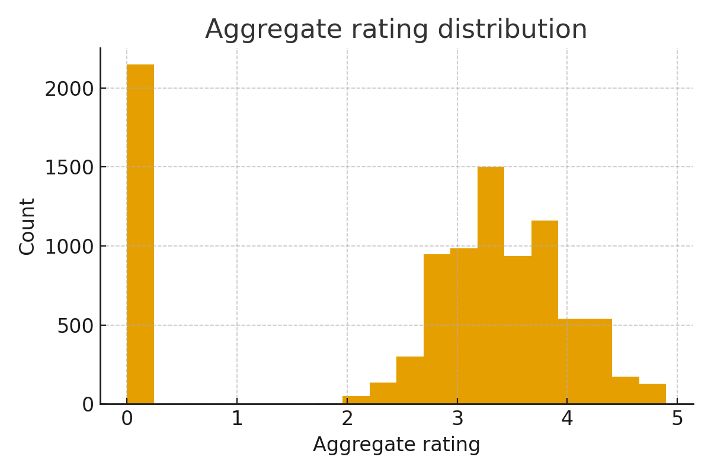
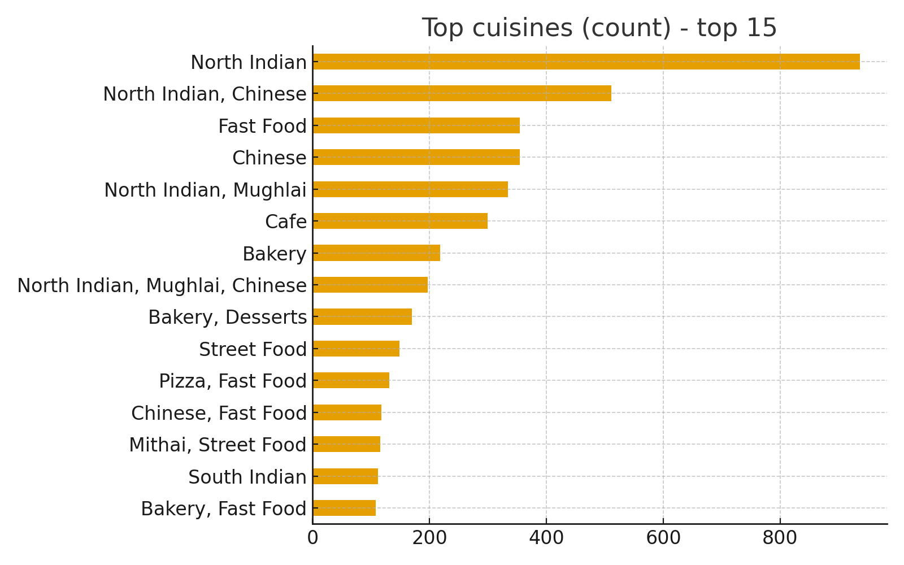
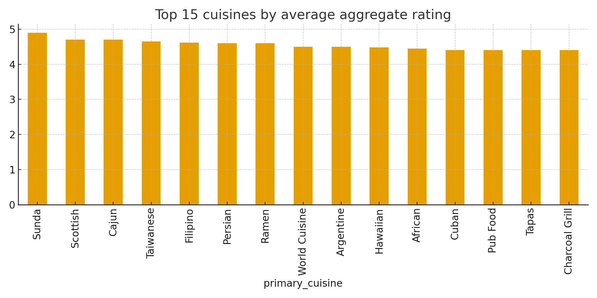
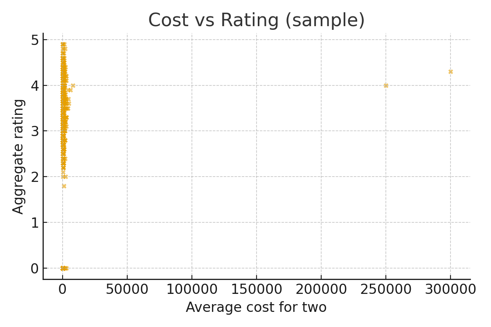
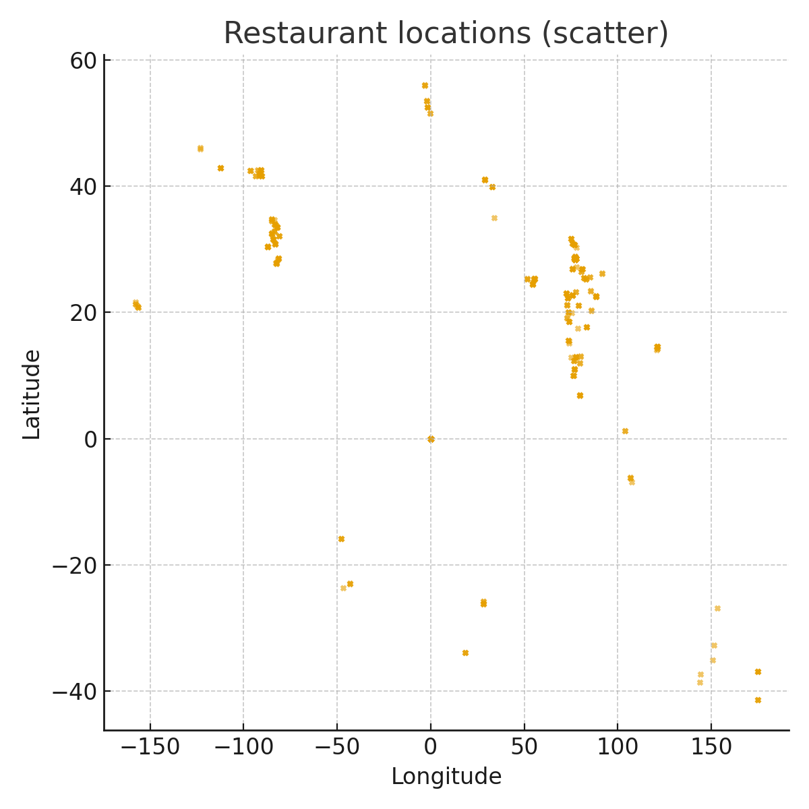

# Restaurant Data Analytics & Rating Prediction

## Overview

This project was developed during the Cognifyz Data Science Internship and focuses on end-to-end restaurant data analytics, exploratory data analysis (EDA), visualization, and machine learning-based rating prediction.

Using a dataset containing 9,551 restaurant records, the project analyzes customer preferences, cuisine popularity, pricing trends, restaurant locations, and rating patterns to generate actionable business insights.

---

## Business Objectives

* Analyze restaurant performance across multiple cities and cuisines.
* Identify factors influencing customer ratings.
* Explore relationships between pricing and restaurant ratings.
* Visualize geographic distribution of restaurants.
* Build predictive models to estimate restaurant ratings.
* Generate automated analytical reports for decision-making.

---

## Dataset Information

* Records: 9,551 Restaurants
* Features: 38 Attributes
* Data Types: Numerical, Categorical, Geographic
* Key Variables:

  * Restaurant Name
  * City
  * Cuisines
  * Average Cost for Two
  * Aggregate Rating
  * Votes
  * Online Delivery Availability
  * Table Booking Availability
  * Geographic Coordinates

---

## Project Workflow

### 1. Data Cleaning & Preprocessing

* Handled missing values and inconsistent records.
* Performed data validation and feature preparation.
* Generated cleaned datasets for analysis and modeling.

### 2. Exploratory Data Analysis (EDA)

* Rating distribution analysis.
* Cuisine popularity analysis.
* Cost vs Rating analysis.
* City-wise restaurant distribution.
* Customer engagement analysis using votes and ratings.

### 3. Data Visualization

Created visualizations to uncover trends and patterns:

* Aggregate Rating Distribution
* Top Cuisine Analysis
* Average Rating by Cuisine
* Cost vs Rating Relationship
* Restaurant Geographic Distribution

### 4. Machine Learning

Implemented and evaluated regression models for restaurant rating prediction:

* Linear Regression
* Random Forest Regressor

---

## Model Performance

| Model                   | RMSE   | MAE    | R² Score |
| ----------------------- | ------ | ------ | -------- |
| Linear Regression       | 1.3173 | 1.0989 | 0.2376   |
| Random Forest Regressor | 0.3423 | 0.2234 | 0.9485   |

### Key Result

The Random Forest Regressor achieved an R² score of **94.85%**, significantly outperforming Linear Regression and demonstrating strong predictive capability for restaurant rating estimation.

---

## Key Insights

* North Indian cuisine emerged as the most represented cuisine category.
* Restaurant ratings are concentrated between 3.0 and 4.0.
* Pricing alone does not strongly determine customer ratings.
* Geographic analysis reveals restaurant clustering in major urban regions.
* Online delivery and customer engagement metrics influence restaurant performance.

---

## Technologies Used

### Programming

* Python

### Data Analysis

* Pandas
* NumPy

### Visualization

* Matplotlib
* Seaborn

### Machine Learning

* Scikit-Learn

### Development Environment

* Jupyter Notebook

---

## Repository Structure

```text
restaurant-data-analytics-rating-prediction
│
├── data/
│   ├── Dataset.csv
│   ├── cleaned_dataset.csv
│   ├── avg_rating_by_price_range.csv
│   ├── numeric_describe.csv
│   ├── top_cities.csv
│   └── top_cuisines.csv
│
├── notebooks/
│   └── All_Tasks_notebook.ipynb
│
├── reports/
│   ├── report.html
│   ├── summary.txt
│   ├── model_metrics.json
│   └── All_Tasks_withoutputs.pdf
│
├── visualizations/
│   ├── rating_distribution.png
│   ├── top_cuisines.png
│   ├── avg_rating_by_cuisine.png
│   ├── cost_vs_rating.png
│   └── locations_scatter.png
│
├── requirements.txt
└── README.md
```

---

## Sample Visualizations

### Rating Distribution



### Top Cuisines



### Average Rating by Cuisine



### Cost vs Rating



### Restaurant Locations



---

## Installation

```bash
pip install -r requirements.txt
```

---

## Future Enhancements

* Interactive Power BI Dashboard
* Restaurant Recommendation System
* Sentiment Analysis on Customer Reviews
* Deployment using Streamlit
* Advanced Ensemble Learning Models

---

## Author

Akshaya

Data Analytics | Data Science | Machine Learning

---

### Internship

Completed as part of the Cognifyz Technologies Data Science Internship Program, covering Data Exploration, Data Visualization, Predictive Modeling, and Business Analytics.
